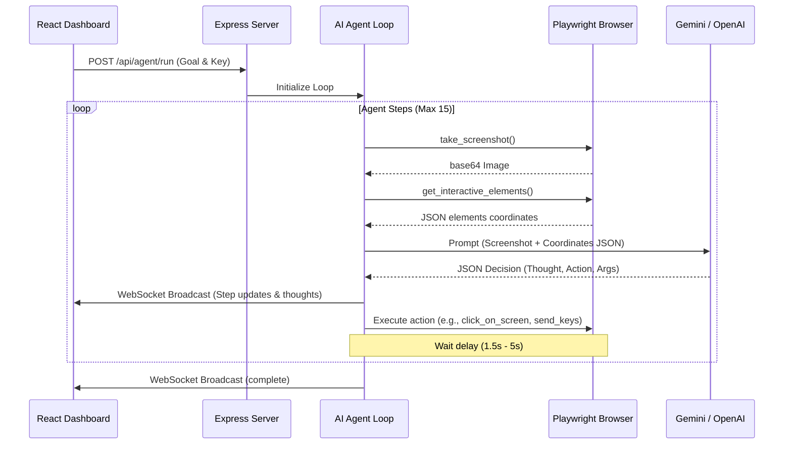

# Architecture Document - Website Automation Agent

This document explains the design decisions, component structures, and the AI agent's execution loop.

---

## 1. Directory Structure

The project is structured as a monorepo containing a separate backend (Node/Express/Playwright) and frontend (Vite/React):
```
website-automation-agent/
├── backend/
│   ├── index.js          # Express app & WebSocket broker
│   ├── browser.js        # Playwright controller & DOM crawler
│   ├── agent.js          # LLM loop driver (Gemini/OpenAI)
│   └── package.json
├── frontend/
│   ├── src/
│   │   ├── main.jsx      # React entrypoint
│   │   ├── App.jsx       # Dashboard UI
│   │   └── App.css       # Styling & Glassmorphic system
│   ├── index.html
│   └── package.json
├── README.md             # Setup & Launch guide
└── Architecture.md       # Architecture specification (this file)
```

---

## 2. Browser Tooling (`backend/browser.js`)

The `BrowserController` class wraps Playwright to implement the required capabilities:
- **`open_browser()`**: Initializes Chromium with standard window dimensions (`1024x768`). Setups a clean browser context.
- **`navigate_to_url(url)`**: Directs Playwright's page pointer to the specified target.
- **`take_screenshot()`**: Captures page contents and returns raw PNG data converted into a base64 string.
- **`click_on_screen(x, y)`**: Performs absolute coordinates clicking. It injects a brief styling helper element in the page DOM at `(x, y)` to indicate click visual feedback on the live screen capture.
- **`send_keys(keys)`**: Focuses the input element and types text. Handles special keys (like `Enter`, `Tab`, `Backspace`) using `page.keyboard.press()`.
- **`scroll(direction, amount)`**: Calls `window.scrollBy({ behavior: 'smooth' })` inside the browser viewport context to reveal elements above or below.
- **`double_click(x, y)`**: Dispatches double mouse click at absolute coordinates.

---

## 3. Visual & Element Detection System

Since the agent is visual, it matches screenshots with element metadata:
1. **Interactive element selection**: The browser page evaluates an in-page script that queries visible interactive DOM tags:
   `button, input, textarea, select, a, [role="button"], [contenteditable="true"]`
2. **Visibility check**: Filters out elements that have `display: none`, `visibility: hidden`, `opacity: 0`, or size `width === 0 || height === 0`.
3. **Coordinate extraction**: Gets the bounding rect of the element using `getBoundingClientRect()` and calculates the absolute center coordinates `(x, y)` relative to the viewport.
4. **Context parsing (Labels)**: For inputs and textareas, it automatically queries matching `<label>` text content using the element's `id` or searches parent elements (up to 3 levels) to associate surrounding label descriptions with the field. This helps the LLM easily understand what input represents what form field.
5. **Output**: Passes a simplified JSON array of elements to the LLM:
   ```json
   {
     "id": 4,
     "tagName": "input",
     "text": "Label: \"Username\" | @username",
     "x": 348,
     "y": 280,
     "width": 360,
     "height": 40
   }
   ```

---

## 4. AI Reasoning & Command Execution Loop (`backend/agent.js`)

The AI Agent acts as a central coordinator in an execution loop:



1. **Information Package**: The prompt combines system guidelines, the target task, the interactive DOM coordinates, and the current base64 page screenshot.
2. **Multimodal Reasoning**: Gemini/OpenAI reads both the screenshot (visually verifying position, overlays, active fields, or alerts) and the DOM coordinates.
3. **Structured Response**: The LLM is forced to output a JSON schema specifying:
   - `thought`: Reason for the current action.
   - `action`: The tool name to invoke.
   - `args`: Arguments passed to the tool.
4. **Execution**: The backend parses the JSON, executes the command against the Playwright instance, waits for the configured delay, and repeats.

---

## 5. Live State Sync & Streaming

- **HTTP REST APIs**: Used for discrete manual commands (like Launch, Close, Navigate).
- **WebSockets (`ws`)**: Broadcasts browser outputs to all connected dashboards. When the AI agent takes a step:
  - It broadcasts the new thought and scheduled action.
  - It broadcasts the post-action base64 screenshot.
  - The React frontend receives this and draws the screenshot on a canvas, overlaying mouse tracking tooltips, active agent click visualizers, and updating the scrolling terminal log panel.
